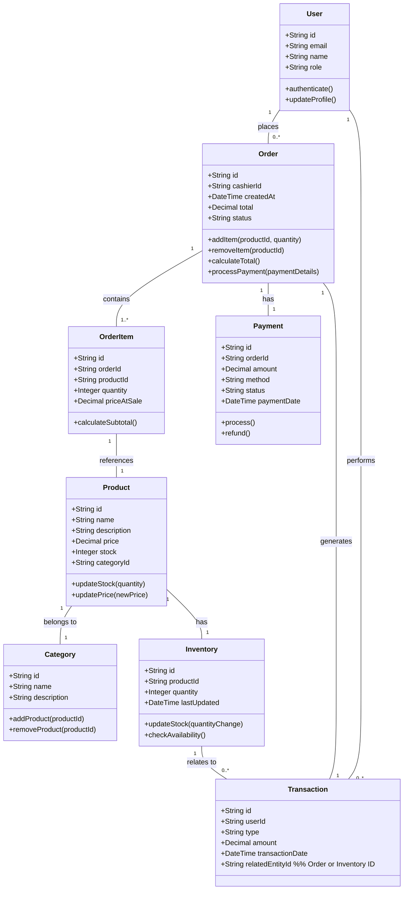

```mermaid
classDiagram
    class User {
        +String id
        +String email
        +String name
        +String role
        +authenticate()
        +updateProfile()
    }

    class Product {
        +String id
        +String name
        +String description
        +Decimal price
        +Integer stock
        +String categoryId
        +updateStock(quantity)
        +updatePrice(newPrice)
    }

    class Category {
        +String id
        +String name
        +String description
        +addProduct(productId)
        +removeProduct(productId)
    }

    class Order {
        +String id
        +String cashierId
        +DateTime createdAt
        +Decimal total
        +String status
        +addItem(productId, quantity)
        +removeItem(productId)
        +calculateTotal()
        +processPayment(paymentDetails)
    }

    class OrderItem {
        +String id
        +String orderId
        +String productId
        +Integer quantity
        +Decimal priceAtSale
        +calculateSubtotal()
    }

    class Payment {
        +String id
        +String orderId
        +Decimal amount
        +String method
        +String status
        +DateTime paymentDate
        +process()
        +refund()
    }

    class Inventory {
        +String id
        +String productId
        +Integer quantity
        +DateTime lastUpdated
        +updateStock(quantityChange)
        +checkAvailability()
    }

    class Transaction {
        +String id
        +String userId
        +String type
        +Decimal amount
        +DateTime transactionDate
        +String relatedEntityId %% Order or Inventory ID
    }

    User "1" -- "0..*" Order : places
    Order "1" -- "1..*" OrderItem : contains
    OrderItem "1" -- "1" Product : references
    Product "1" -- "1" Category : belongs to
    Order "1" -- "1" Payment : has
    Product "1" -- "1" Inventory : has
    User "1" -- "0..*" Transaction : performs
    Order "1" -- "1" Transaction : generates
    Inventory "1" -- "0..*" Transaction : relates to
``` 