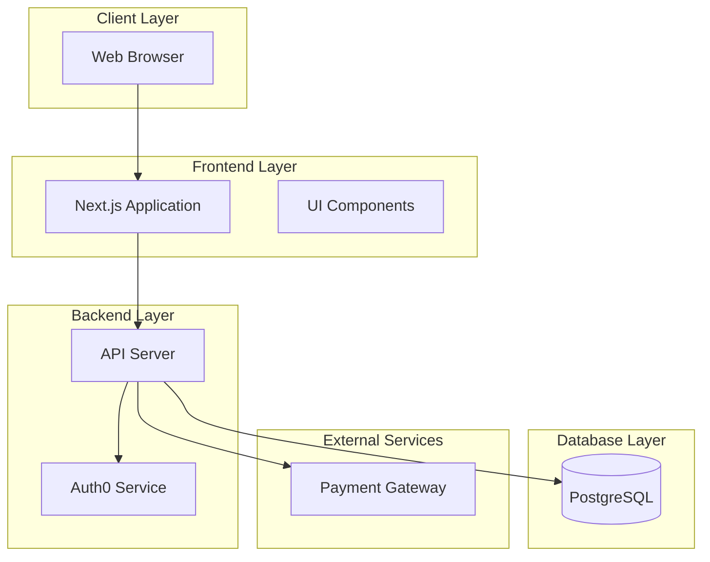

```mermaid
graph TB
    subgraph Client[Client Layer]
        Browser[Web Browser]
    end

    subgraph Frontend[Frontend Layer]
        NextJS[Next.js Application]
        UI[UI Components]
    end

    subgraph Backend[Backend Layer]
        API[API Server]
        Auth[Auth0 Service]
    end

    subgraph Database[Database Layer]
        PostgreSQL[(PostgreSQL)]
    end

    subgraph External[External Services]
        PaymentGateway[Payment Gateway]
    end

    %% Connections
    Browser --> NextJS
    NextJS --> API
    API --> Auth
    API --> PostgreSQL
    API --> PaymentGateway
``` 