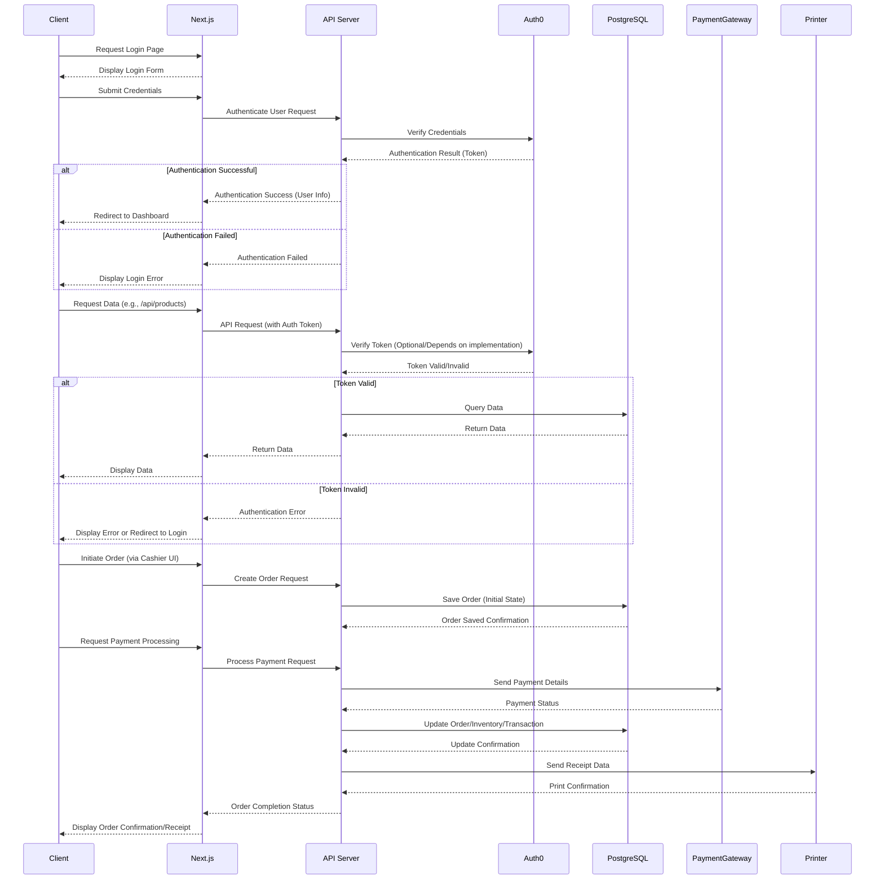

```mermaid
sequenceDiagram
    participant Client
    participant Frontend as Next.js
    participant Backend as API Server
    participant Auth0
    participant Database as PostgreSQL
    participant PaymentGateway
    participant Printer

    %% Scenario: User Login
    Client->>Frontend: Request Login Page
    Frontend-->>Client: Display Login Form
    Client->>Frontend: Submit Credentials
    Frontend->>Backend: Authenticate User Request
    Backend->>Auth0: Verify Credentials
    Auth0-->>Backend: Authentication Result (Token)
    alt Authentication Successful
        Backend-->>Frontend: Authentication Success (User Info)
        Frontend-->>Client: Redirect to Dashboard
    else Authentication Failed
        Backend-->>Frontend: Authentication Failed
        Frontend-->>Client: Display Login Error
    end

    %% Scenario: Fetching Data (e.g., Products for Admin)
    Client->>Frontend: Request Data (e.g., /api/products)
    Frontend->>Backend: API Request (with Auth Token)
    Backend->>Auth0: Verify Token (Optional/Depends on implementation)
    Auth0-->>Backend: Token Valid/Invalid
    alt Token Valid
        Backend->>Database: Query Data
        Database-->>Backend: Return Data
        Backend-->>Frontend: Return Data
        Frontend-->>Client: Display Data
    else Token Invalid
        Backend-->>Frontend: Authentication Error
        Frontend-->>Client: Display Error or Redirect to Login
    end

    %% Scenario: Processing Order (Simplified)
    Client->>Frontend: Initiate Order (via Cashier UI)
    Frontend->>Backend: Create Order Request
    Backend->>Database: Save Order (Initial State)
    Database-->>Backend: Order Saved Confirmation
    %% ... Item adding loop happens here (details in Order Processing Sequence Diagram) ...
    Client->>Frontend: Request Payment Processing
    Frontend->>Backend: Process Payment Request
    Backend->>PaymentGateway: Send Payment Details
    PaymentGateway-->>Backend: Payment Status
    Backend->>Database: Update Order/Inventory/Transaction
    Database-->>Backend: Update Confirmation
    Backend->>Printer: Send Receipt Data
    Printer-->>Backend: Print Confirmation
    Backend-->>Frontend: Order Completion Status
    Frontend-->>Client: Display Order Confirmation/Receipt

``` 