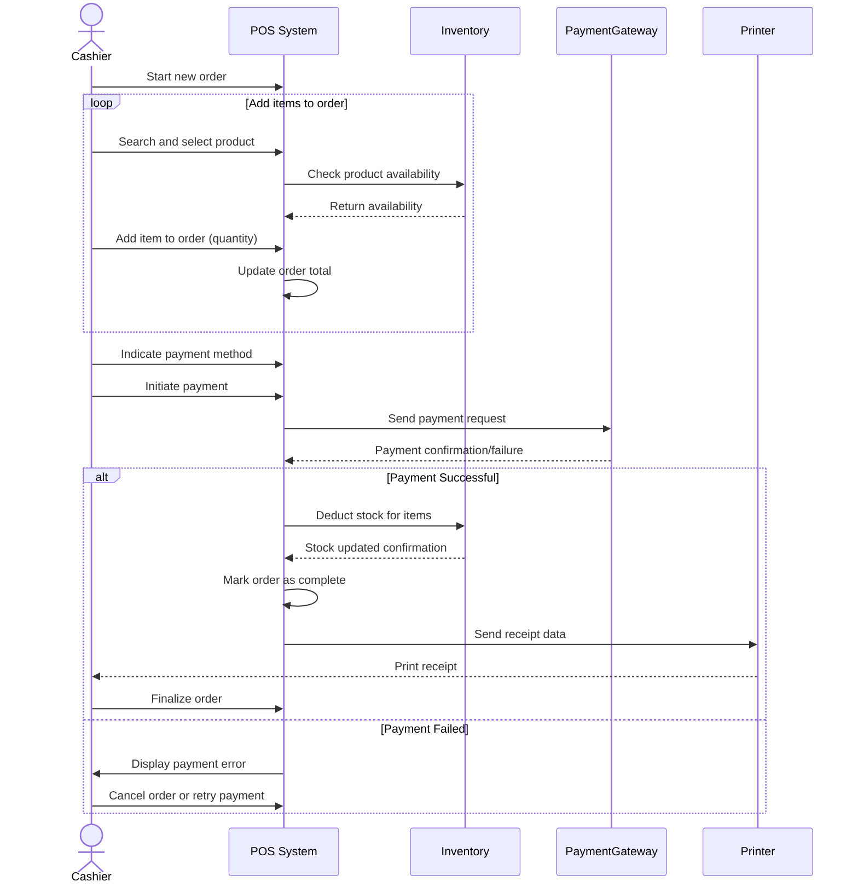

```mermaid
sequenceDiagram
    actor Cashier
    participant POS as POS System
    participant Inventory
    participant PaymentGateway
    participant Printer

    Cashier->>POS: Start new order
    loop Add items to order
        Cashier->>POS: Search and select product
        POS->>Inventory: Check product availability
        Inventory-->>POS: Return availability
        Cashier->>POS: Add item to order (quantity)
        POS->>POS: Update order total
    end
    Cashier->>POS: Indicate payment method
    Cashier->>POS: Initiate payment
    POS->>PaymentGateway: Send payment request
    PaymentGateway-->>POS: Payment confirmation/failure
    alt Payment Successful
        POS->>Inventory: Deduct stock for items
        Inventory-->>POS: Stock updated confirmation
        POS->>POS: Mark order as complete
        POS->>Printer: Send receipt data
        Printer-->>Cashier: Print receipt
        Cashier->>POS: Finalize order
    else Payment Failed
        POS->>Cashier: Display payment error
        Cashier->>POS: Cancel order or retry payment
    end
``` 