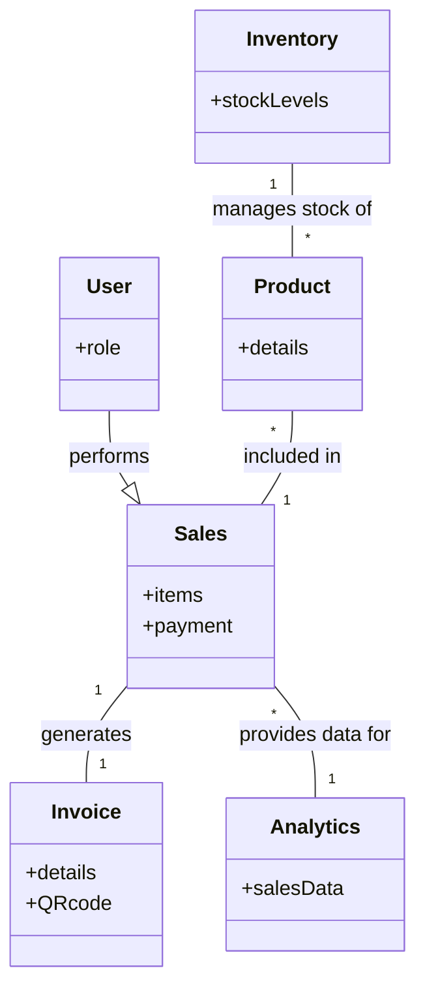

```mermaid
classDiagram
    class User {
        +role
    }

    class Product {
        +details
    }

    class Sales {
        +items
        +payment
    }

    class Invoice {
        +details
        +QRcode
    }

    class Inventory {
        +stockLevels
    }

    class Analytics {
        +salesData
    }

    User --|> Sales : performs
    Sales "1" -- "1" Invoice : generates
    Product "*" -- "1" Sales : included in
    Inventory "1" -- "*" Product : manages stock of
    Sales "*" -- "1" Analytics : provides data for
``` 