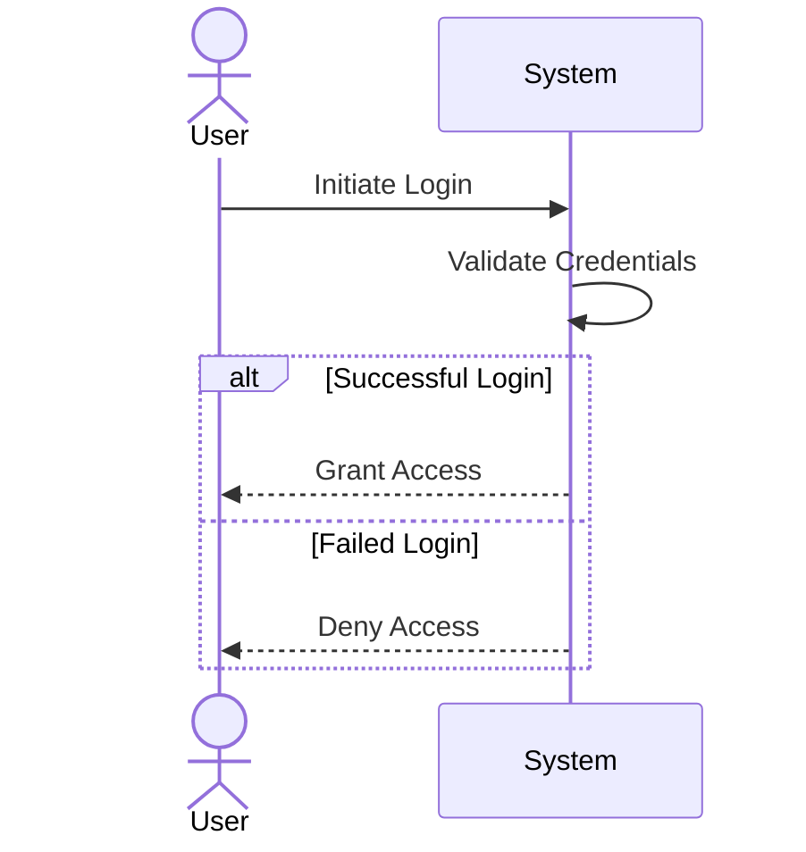

```mermaid
sequenceDiagram
    actor User
    participant System

    %% Sprint 0 (Conceptual Login)

    User->>System: Initiate Login
    System->>System: Validate Credentials

    alt Successful Login
        System-->>User: Grant Access
    else Failed Login
        System-->>User: Deny Access
    end

    %% Note: This is a highly conceptual diagram based on initial Sprint 0 requirements.
``` 