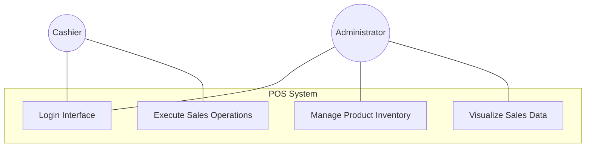

```mermaid
flowchart TB
    %% Actors defined in Sprint 0
    Admin((Administrator))
    Cashier((Cashier))

    %% Functional Requirements defined in Sprint 0
    subgraph POS_System[POS System]
        Login[Login Interface]
        POS_Ops[Execute Sales Operations]
        Admin_ProdInv[Manage Product Inventory]
        Admin_SalesData[Visualize Sales Data]
    end

    %% Relationships defined in Sprint 0
    Admin --- Login
    Admin --- Admin_ProdInv
    Admin --- Admin_SalesData

    Cashier --- Login
    Cashier --- POS_Ops

    %% Note: Role-based redirection happens after login
``` 