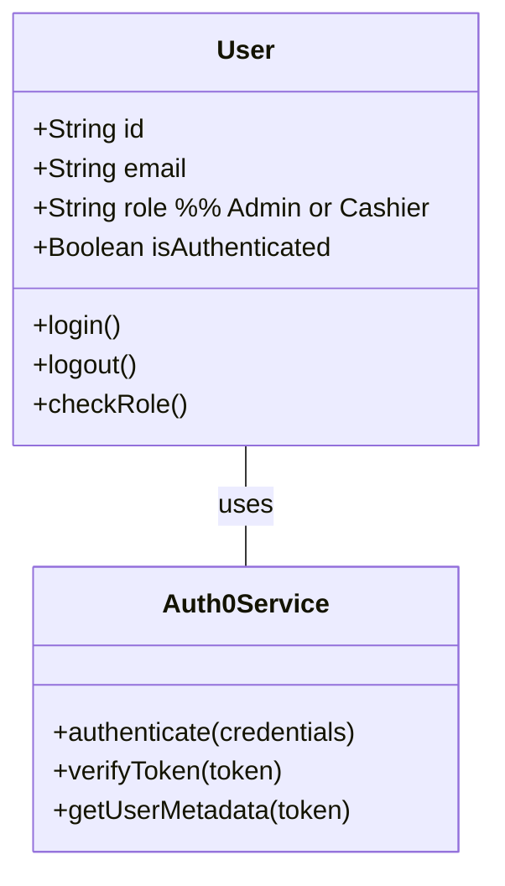

```mermaid
classDiagram
    class User {
        +String id
        +String email
        +String role %% Admin or Cashier
        +Boolean isAuthenticated
        +login()
        +logout()
        +checkRole()
    }

    class Auth0Service {
        +authenticate(credentials)
        +verifyToken(token)
        +getUserMetadata(token)
    }

    User -- Auth0Service : uses
``` 