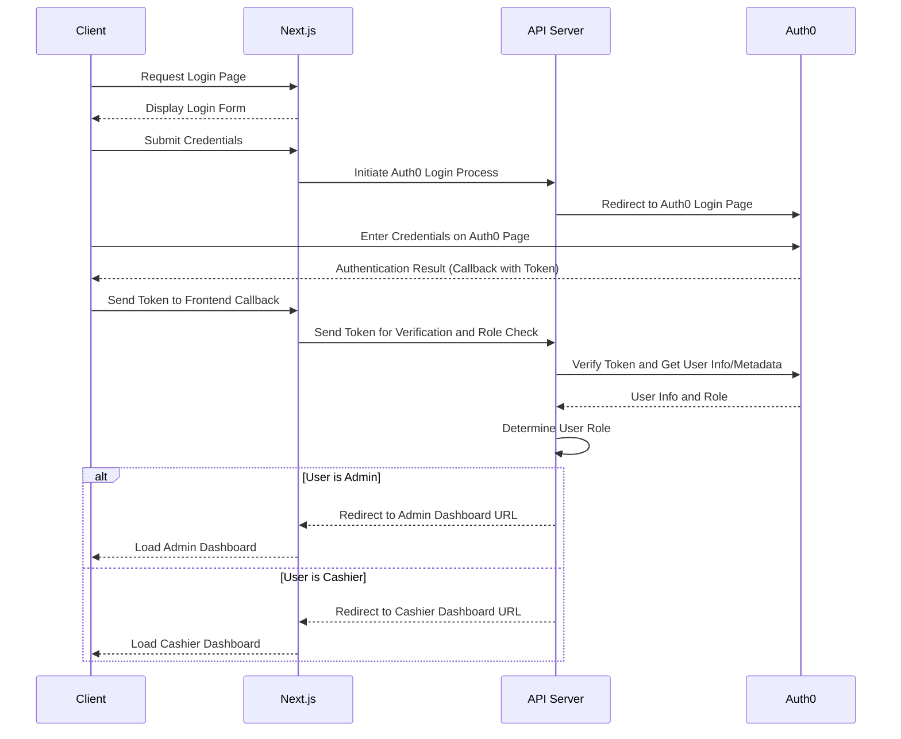

```mermaid
sequenceDiagram
    participant Client
    participant Frontend as Next.js
    participant Backend as API Server
    participant Auth0

    %% Sprint 1: User Login and Role Redirection

    Client->>Frontend: Request Login Page
    Frontend-->>Client: Display Login Form

    Client->>Frontend: Submit Credentials
    Frontend->>Backend: Initiate Auth0 Login Process
    Backend->>Auth0: Redirect to Auth0 Login Page

    Client->>Auth0: Enter Credentials on Auth0 Page
    Auth0-->>Client: Authentication Result (Callback with Token)

    Client->>Frontend: Send Token to Frontend Callback
    Frontend->>Backend: Send Token for Verification and Role Check

    Backend->>Auth0: Verify Token and Get User Info/Metadata
    Auth0-->>Backend: User Info and Role

    Backend->>Backend: Determine User Role

    alt User is Admin
        Backend-->>Frontend: Redirect to Admin Dashboard URL
        Frontend-->>Client: Load Admin Dashboard
    else User is Cashier
        Backend-->>Frontend: Redirect to Cashier Dashboard URL
        Frontend-->>Client: Load Cashier Dashboard
    end

    %% Note: This diagram focuses specifically on the authentication and routing flow of Sprint 1.
``` 