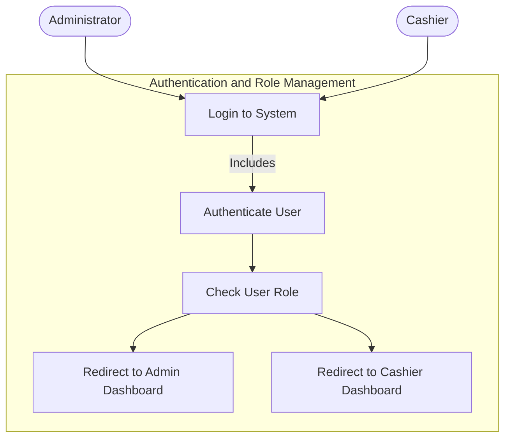

```mermaid
flowchart TB
    %% Actors from Sprint 0 (represented with rounded corners)
    Admin([Administrator])
    Cashier([Cashier])

    %% Use Cases implemented/refined in Sprint 1 (represented with rectangles)
    subgraph Authentication_and_Role_Management[Authentication and Role Management]
        Login[Login to System]
        Authenticate[Authenticate User]
        CheckRole[Check User Role]
        RedirectAdmin[Redirect to Admin Dashboard]
        RedirectCashier[Redirect to Cashier Dashboard]
    end

    %% Relationships for Sprint 1
    Admin --> Login
    Cashier --> Login

    Login -- Includes --> Authenticate
    Authenticate --> CheckRole
    CheckRole --> RedirectAdmin
    CheckRole --> RedirectCashier

    %% Note: This diagram is a representation of the Use Case based on Sprint 1,
    %% using flowchart syntax for broader compatibility.
``` 