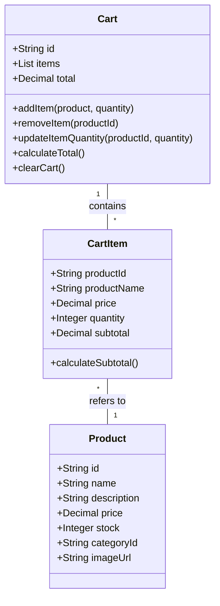

```mermaid
classDiagram
    class Product {
        +String id
        +String name
        +String description
        +Decimal price
        +Integer stock
        +String categoryId
        +String imageUrl
    }

    class Cart {
        +String id
        +List<CartItem> items
        +Decimal total
        +addItem(product, quantity)
        +removeItem(productId)
        +updateItemQuantity(productId, quantity)
        +calculateTotal()
        +clearCart()
    }

    class CartItem {
        +String productId
        +String productName
        +Decimal price
        +Integer quantity
        +Decimal subtotal
        +calculateSubtotal()
    }

    Cart "1" -- "*" CartItem : contains
    CartItem "*" -- "1" Product : refers to
``` 