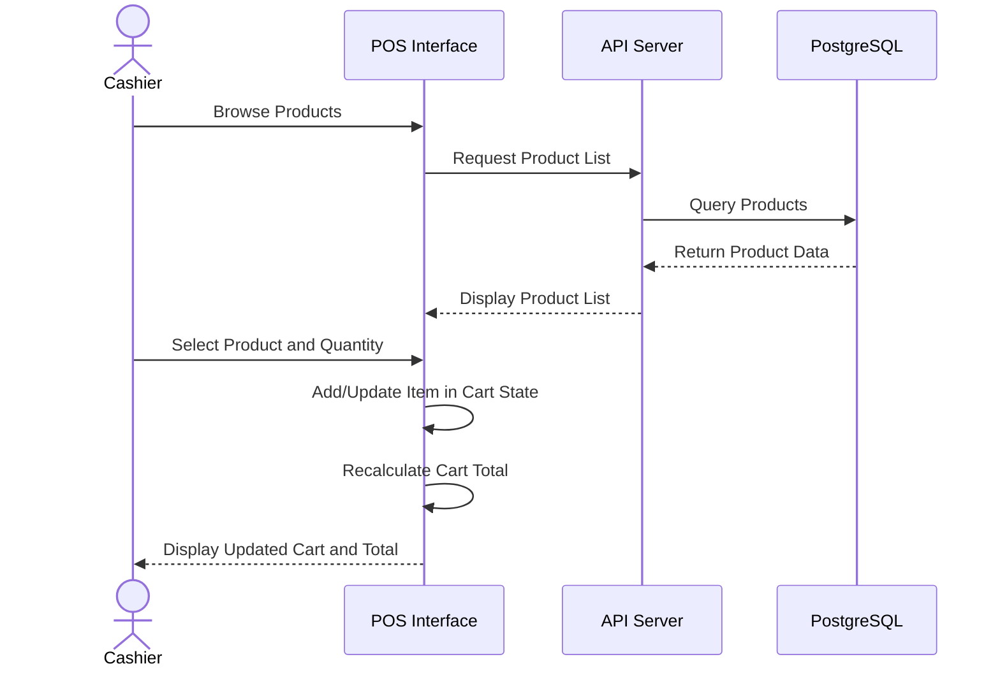

```mermaid
sequenceDiagram
    actor Cashier
    participant Frontend as POS Interface
    participant Backend as API Server
    participant Database as PostgreSQL

    %% Sprint 2: Adding Product to Cart

    Cashier->>Frontend: Browse Products
    Frontend->>Backend: Request Product List
    Backend->>Database: Query Products
    Database-->>Backend: Return Product Data
    Backend-->>Frontend: Display Product List

    Cashier->>Frontend: Select Product and Quantity
    Frontend->>Frontend: Add/Update Item in Cart State
    Frontend->>Frontend: Recalculate Cart Total
    Frontend-->>Cashier: Display Updated Cart and Total

    %% Note: This diagram focuses on the interaction when adding/updating a product in the cart within the POS interface.
``` 