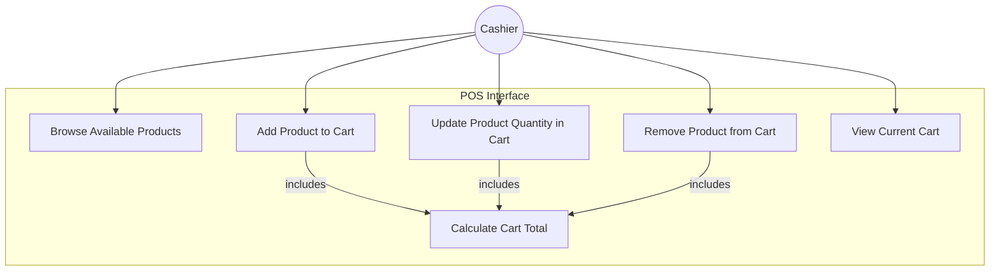

```mermaid
flowchart TB
    %% Actor for Sprint 2
    Cashier((Cashier))

    %% Use Cases implemented in Sprint 2
    subgraph POS_Interface[POS Interface]
        BrowseProducts[Browse Available Products]
        AddToCart[Add Product to Cart]
        UpdateCartItem[Update Product Quantity in Cart]
        RemoveFromCart[Remove Product from Cart]
        ViewCart[View Current Cart]
        CalculateTotal[Calculate Cart Total]
    end

    %% Relationships for Sprint 2
    Cashier --> BrowseProducts
    Cashier --> AddToCart
    Cashier --> UpdateCartItem
    Cashier --> RemoveFromCart
    Cashier --> ViewCart

    AddToCart -- includes --> CalculateTotal
    UpdateCartItem -- includes --> CalculateTotal
    RemoveFromCart -- includes --> CalculateTotal

    %% Note: This diagram focuses on the cashier's interaction with the POS interface for managing the cart.
``` 