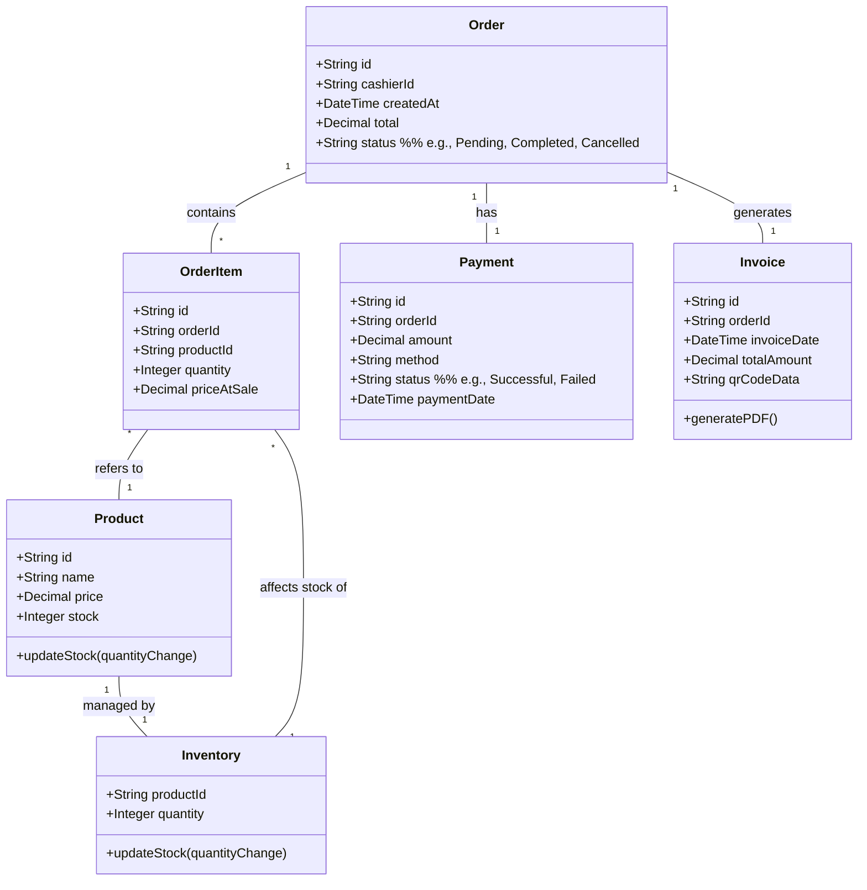

```mermaid
classDiagram
    class Product {
        +String id
        +String name
        +Decimal price
        +Integer stock
        +updateStock(quantityChange)
    }

    class Order {
        +String id
        +String cashierId
        +DateTime createdAt
        +Decimal total
        +String status %% e.g., Pending, Completed, Cancelled
    }

    class OrderItem {
        +String id
        +String orderId
        +String productId
        +Integer quantity
        +Decimal priceAtSale
    }

    class Payment {
        +String id
        +String orderId
        +Decimal amount
        +String method
        +String status %% e.g., Successful, Failed
        +DateTime paymentDate
    }

    class Invoice {
        +String id
        +String orderId
        +DateTime invoiceDate
        +Decimal totalAmount
        +String qrCodeData
        +generatePDF()
    }

    class Inventory {
        +String productId
        +Integer quantity
        +updateStock(quantityChange)
    }

    Order "1" -- "*" OrderItem : contains
    OrderItem "*" -- "1" Product : refers to
    Order "1" -- "1" Payment : has
    Order "1" -- "1" Invoice : generates
    Product "1" -- "1" Inventory : managed by
    OrderItem "*" -- "1" Inventory : affects stock of
``` 