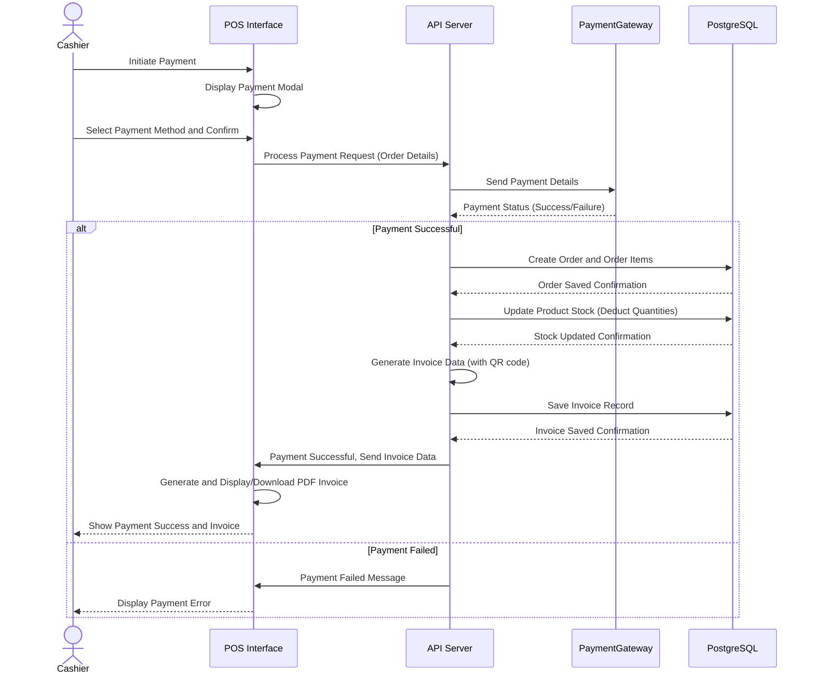

```mermaid
sequenceDiagram
    actor Cashier
    participant Frontend as POS Interface
    participant Backend as API Server
    participant PaymentGateway
    participant Database as PostgreSQL

    %% Sprint 3: Checkout, Invoicing, and Stock Update

    Cashier->>Frontend: Initiate Payment
    Frontend->>Frontend: Display Payment Modal
    Cashier->>Frontend: Select Payment Method and Confirm
    Frontend->>Backend: Process Payment Request (Order Details)
    Backend->>PaymentGateway: Send Payment Details
    PaymentGateway-->>Backend: Payment Status (Success/Failure)

    alt Payment Successful
        Backend->>Database: Create Order and Order Items
        Database-->>Backend: Order Saved Confirmation
        Backend->>Database: Update Product Stock (Deduct Quantities)
        Database-->>Backend: Stock Updated Confirmation
        Backend->>Backend: Generate Invoice Data (with QR code)
        Backend->>Database: Save Invoice Record
        Database-->>Backend: Invoice Saved Confirmation
        Backend->>Frontend: Payment Successful, Send Invoice Data
        Frontend->>Frontend: Generate and Display/Download PDF Invoice
        Frontend-->>Cashier: Show Payment Success and Invoice
    else Payment Failed
        Backend->>Frontend: Payment Failed Message
        Frontend-->>Cashier: Display Payment Error
    end

    %% Note: This diagram focuses on the backend processes during checkout.
``` 