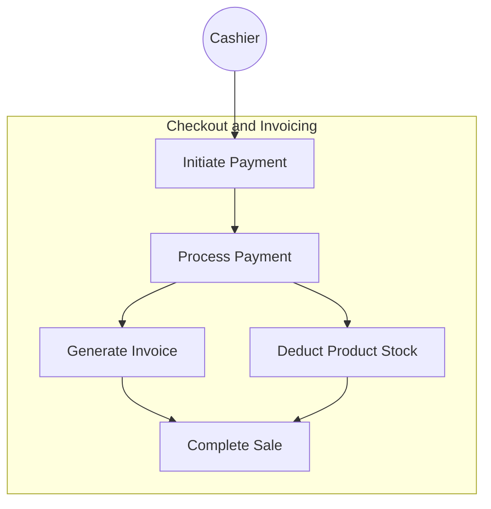

```mermaid
flowchart TB
    %% Actor for Sprint 3
    Cashier((Cashier))

    %% Use Cases implemented in Sprint 3
    subgraph Checkout_and_Invoicing[Checkout and Invoicing]
        InitiatePayment[Initiate Payment]
        ProcessPayment[Process Payment]
        GenerateInvoice[Generate Invoice]
        DeductStock[Deduct Product Stock]
        CompleteSale[Complete Sale]
    end

    %% Relationships for Sprint 3
    Cashier --> InitiatePayment

    InitiatePayment --> ProcessPayment
    ProcessPayment --> GenerateInvoice
    ProcessPayment --> DeductStock
    GenerateInvoice --> CompleteSale
    DeductStock --> CompleteSale

    %% Note: This diagram focuses on the process of completing a sale and generating an invoice.
``` 