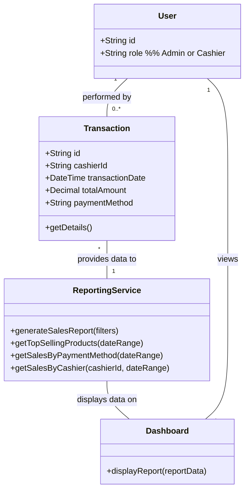

```mermaid
classDiagram
    class User {
        +String id
        +String role %% Admin or Cashier
    }

    class Transaction {
        +String id
        +String cashierId
        +DateTime transactionDate
        +Decimal totalAmount
        +String paymentMethod
        +getDetails()
    }

    class ReportingService {
        +generateSalesReport(filters)
        +getTopSellingProducts(dateRange)
        +getSalesByPaymentMethod(dateRange)
        +getSalesByCashier(cashierId, dateRange)
    }

    class Dashboard {
        +displayReport(reportData)
    }

    User "1" -- "0..*" Transaction : performed by
    Transaction "*" -- "1" ReportingService : provides data to
    ReportingService -- Dashboard : displays data on
    User "1" -- "*" Dashboard : views
``` 