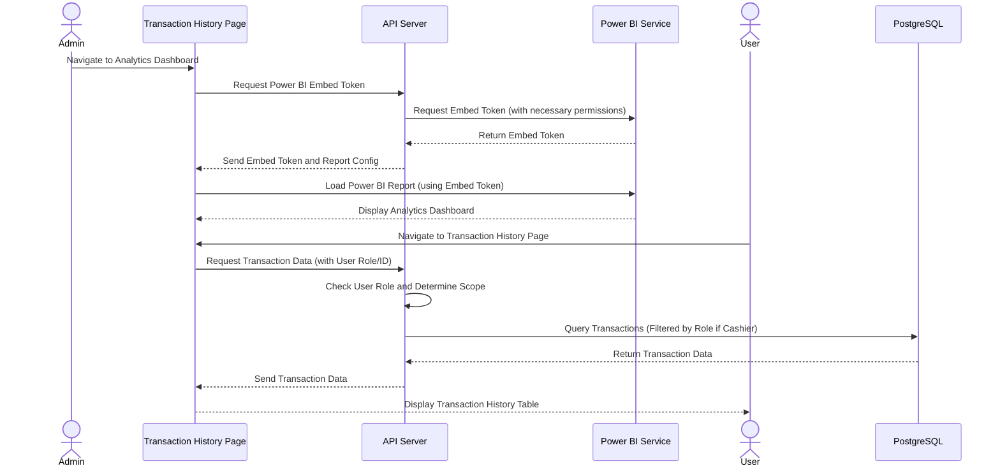

```mermaid
sequenceDiagram
    actor Admin
    participant Frontend as Admin Dashboard
    participant Backend as API Server
    participant PowerBI as Power BI Service

    %% Sprint 4: Admin Views Analytics Dashboard

    Admin->>Frontend: Navigate to Analytics Dashboard
    Frontend->>Backend: Request Power BI Embed Token
    Backend->>PowerBI: Request Embed Token (with necessary permissions)
    PowerBI-->>Backend: Return Embed Token
    Backend-->>Frontend: Send Embed Token and Report Config
    Frontend->>PowerBI: Load Power BI Report (using Embed Token)
    PowerBI-->>Frontend: Display Analytics Dashboard

    %% --- Separate Flow: Viewing Transaction History ---

    actor User
    participant Frontend as Transaction History Page
    participant Backend as API Server
    participant Database as PostgreSQL

    User->>Frontend: Navigate to Transaction History Page
    Frontend->>Backend: Request Transaction Data (with User Role/ID)
    Backend->>Backend: Check User Role and Determine Scope
    Backend->>Database: Query Transactions (Filtered by Role if Cashier)
    Database-->>Backend: Return Transaction Data
    Backend-->>Frontend: Send Transaction Data
    Frontend-->>User: Display Transaction History Table

    %% Note: This diagram shows two separate flows related to Sprint 4 reporting.
``` 